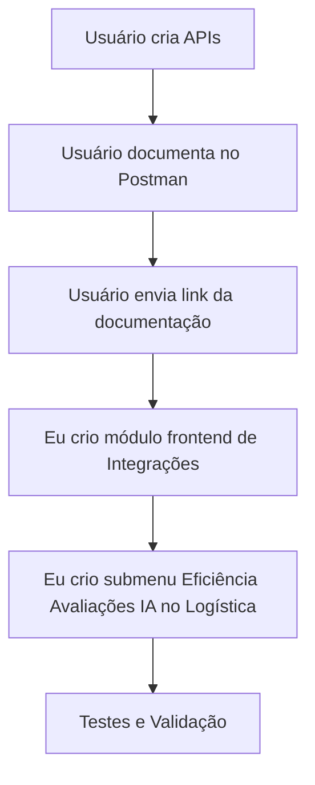

# Plano de Tarefas: Documentação Postman, Quadrante Integrações e Eficiência Avaliações IA

## Visão Geral do Plano

Este documento apresenta o planejamento detalhado para três tarefas principais:
1. **Documentação Postman** - Criar documentação das APIs
2. **Quadrante de Integrações** - Criar módulo para documentação de campos e retornos
3. **Eficiência Avaliações IA** - Criar submenu em Logística com análises comparativas

---

## TAREFA 1: Eficiência Avaliações IA (Logística)

### 1.1 Consultas SQL Necessárias

Baseado nas queries existentes em [`analise_aval.py`](analise_aval.py:111), as seguintes consultas SQL são necessárias:

#### Query 1: Dados Detalhados de Avaliações IA
```sql
-- Detalhamento: Comparação entre grade do avaliador humano e sugestão da IA
SELECT 
    o."Imei",
    o."DeviceDescription" AS "Modelo",
    TRIM(UPPER(gl."Name")) AS "Grade_Humano",
    TRIM(UPPER(agl."Level")) AS "Grade_IA",
    CASE 
        WHEN TRIM(UPPER(gl."Name")) = TRIM(UPPER(agl."Level")) THEN 'ACERTOU'
        ELSE 'ERROU'
    END AS "Status_Assertividade",
    CASE 
        WHEN TRIM(UPPER(gl."Name")) = TRIM(UPPER(agl."Level")) THEN 1
        ELSE 0
    END AS "Is_Match",
    a."CreatedOn" AS "Data_Avaliacao",
    'https://app.renovsmart.com.br/trade-in/device-housing-evaluations/view/' || dh."Id"::text AS "Link_Fotos"
FROM "Catalog"."Orders" o 
INNER JOIN "Catalog"."DeviceHousingEvaluations" dh ON o."Id" = dh."OrderId"
INNER JOIN "Catalog"."GradeLevels" gl ON dh."GradeLevelId" = gl."Id"
INNER JOIN "Catalog"."AiAnalysis" a ON dh."Id" = a."DeviceHousingEvaluationId"
INNER JOIN "Catalog"."AiAnalysisGradeLevels" agl ON a."GradeLevelId" = agl."Id"
WHERE a."CreatedOn" BETWEEN :start_date AND :end_date
AND o."CompanyId" <> '1845c046-c93f-41cf-b47a-f81dd433fdc7'
```

#### Query 2: Resumo de Assertividade por Grade
```sql
-- Resumo: Percentual de acertos da IA por grade do avaliador humano
SELECT 
    TRIM(UPPER(gl."Name")) AS "Grade_Humano_Real",
    COUNT(*) AS "Total_Avaliados",
    SUM(CASE WHEN TRIM(UPPER(gl."Name")) = TRIM(UPPER(agl."Level")) THEN 1 ELSE 0 END) AS "Qtd_Acertos_IA",
    ROUND(
        (SUM(CASE WHEN TRIM(UPPER(gl."Name")) = TRIM(UPPER(agl."Level")) THEN 1 ELSE 0 END)::numeric / COUNT(*)) * 100, 
    2) AS "Percentual_Assertividade",
    STRING_AGG(DISTINCT TRIM(UPPER(agl."Level")), ', ') FILTER (WHERE TRIM(UPPER(gl."Name")) <> TRIM(UPPER(agl."Level"))) AS "Erros_Comuns_IA"
FROM "Catalog"."Orders" o 
INNER JOIN "Catalog"."DeviceHousingEvaluations" dh ON o."Id" = dh."OrderId"
INNER JOIN "Catalog"."GradeLevels" gl ON dh."GradeLevelId" = gl."Id"
INNER JOIN "Catalog"."AiAnalysis" a ON dh."Id" = a."DeviceHousingEvaluationId"
INNER JOIN "Catalog"."AiAnalysisGradeLevels" agl ON a."GradeLevelId" = agl."Id"
WHERE a."CreatedOn" BETWEEN :start_date AND :end_date
AND o."CompanyId" <> '1845c046-c93f-41cf-b47a-f81dd433fdc7'
GROUP BY TRIM(UPPER(gl."Name"))
ORDER BY "Grade_Humano_Real"
```

#### Query 3: Análise por Categoria/Dispositivo
```sql
-- Análise: Acurácia por tipo de dispositivo
SELECT 
    o."DeviceDescription" AS "Dispositivo",
    COUNT(*) AS "Total_Avaliados",
    SUM(CASE WHEN TRIM(UPPER(gl."Name")) = TRIM(UPPER(agl."Level")) THEN 1 ELSE 0 END) AS "Qtd_Acertos",
    ROUND(
        (SUM(CASE WHEN TRIM(UPPER(gl."Name")) = TRIM(UPPER(agl."Level")) THEN 1 ELSE 0 END)::numeric / COUNT(*)) * 100, 
    2) AS "Acuracia"
FROM "Catalog"."Orders" o 
INNER JOIN "Catalog"."DeviceHousingEvaluations" dh ON o."Id" = dh."OrderId"
INNER JOIN "Catalog"."GradeLevels" gl ON dh."GradeLevelId" = gl."Id"
INNER JOIN "Catalog"."AiAnalysis" a ON dh."Id" = a."DeviceHousingEvaluationId"
INNER JOIN "Catalog"."AiAnalysisGradeLevels" agl ON a."GradeLevelId" = agl."Id"
WHERE a."CreatedOn" BETWEEN :start_date AND :end_date
AND o."CompanyId" <> '1845c046-c93f-41cf-b47a-f81dd433fdc7'
GROUP BY o."DeviceDescription"
ORDER BY "Total_Avaliados" DESC
LIMIT 10
```

#### Query 4: Evolução Temporal (Curva de Aprendizado)
```sql
-- Evolução: Acurácia mensal da IA
SELECT 
    DATE_TRUNC('month', a."CreatedOn")::date AS "Mes",
    COUNT(*) AS "Total_Avaliados",
    SUM(CASE WHEN TRIM(UPPER(gl."Name")) = TRIM(UPPER(agl."Level")) THEN 1 ELSE 0 END) AS "Qtd_Acertos",
    ROUND(
        (SUM(CASE WHEN TRIM(UPPER(gl."Name")) = TRIM(UPPER(agl."Level")) THEN 1 ELSE 0 END)::numeric / COUNT(*)) * 100, 
    2) AS "Acuracia_Mensal"
FROM "Catalog"."Orders" o 
INNER JOIN "Catalog"."DeviceHousingEvaluations" dh ON o."Id" = dh."OrderId"
INNER JOIN "Catalog"."GradeLevels" gl ON dh."GradeLevelId" = gl."Id"
INNER JOIN "Catalog"."AiAnalysis" a ON dh."Id" = a."DeviceHousingEvaluationId"
INNER JOIN "Catalog"."AiAnalysisGradeLevels" agl ON a."GradeLevelId" = agl."Id"
WHERE a."CreatedOn" BETWEEN :start_date AND :end_date
AND o."CompanyId" <> '1845c046-c93f-41cf-b47a-f81dd433fdc7'
GROUP BY DATE_TRUNC('month', a."CreatedOn")::date
ORDER BY "Mes"
```

### 1.2 Estrutura de Dados da API

#### Endpoint 1: `/api/avaliacoes-ia/detalhes`
- **Método:** GET
- **Parâmetros:** `start_date`, `end_date`, `imei`, `device_description`, `status_assertividade`
- **Retorno:** Array de objetos com detalhamento de cada avaliação

#### Endpoint 2: `/api/avaliacoes-ia/resumo`
- **Método:** GET
- **Parâmetros:** `start_date`, `end_date`
- **Retorno:** Array de objetos com resumo por grade humano

#### Endpoint 3: `/api/avaliacoes-ia/dispositivos`
- **Método:** GET
- **Parâmetros:** `start_date`, `end_date`
- **Retorno:** Array de objetos com acurácia por dispositivo

#### Endpoint 4: `/api/avaliacoes-ia/evolucao`
- **Método:** GET
- **Parâmetros:** `start_date`, `end_date`
- **Retorno:** Array de objetos com evolução temporal

### 1.3 Estrutura doFrontend (Logística)

**Arquivo:** `client/src/pages/logistica/avaliacoes-ia.tsx`

**Submenu no Sidebar:**
```typescript
const logisticaSubItems = [
  // ... itens existentes
  { title: "Eficiência Avaliações IA", url: "/logistica/avaliacoes-ia", icon: Bot },
];
```

**Layout da Página:**
- Filtros (período, rede, filial, categoria)
- KPIs principais:
  - Total de Avaliações
  - Percentual Geral de Assertividade
  - Total de Acertos
  - Total de Erros
- Gráficos:
  - Gauge de assertividade por grade
  - Curva de aprendizado (evolução mensal)
  - Matriz de erros (top erros comuns)
  - Tabela de acurácia por dispositivo

---

## TAREFA 2: Quadrante de Documentação (Integrações)

### 2.1 Estrutura do Módulo

O quadrante será uma nova seção dentro do módulo de Integrações que documenta todos os campos e retornos possíveis das APIs.

#### Adicionar ao Sidebar:
```typescript
const apisSubItems = [
  // ... itens existentes
  { title: "Documentação de Campos", url: "/apis/documentacao-campos", icon: BookOpen },
];
```

### 2.2 Páginas de Documentação

#### Arquivo: `client/src/pages/apis/documentacao-campos.tsx`

**Seções por API:**

1. **API RS - Logística**
   - Endpoint: `/meus-dispositivos`
   - Endpoint: `/meus-fechamentos`
   - Campos de request/response

2. **API Correios - Logística Reversa**
   - Endpoint: `/solicitar-coleta`
   - Endpoint: `/rastreamento`
   - Campos de request/response

3. **API Adm. Logística**
   - Endpoints existentes
   - Campos de request/response

4. **API Relatório Pedidos**
   - Endpoint: `/orders/advanced`
   - Campos de request/response

### 2.3 Estrutura de Dados para Documentação

Cada API terá uma estrutura padronizada:
```typescript
interface ApiDocumentation {
  name: string;
  description: string;
  baseUrl: string;
  endpoints: {
    path: string;
    method: 'GET' | 'POST' | 'PUT' | 'DELETE';
    description: string;
    requestParams: {
      name: string;
      type: string;
      required: boolean;
      description: string;
    }[];
    responseFields: {
      name: string;
      type: string;
      description: string;
      example: string;
    }[];
    exampleRequest: object;
    exampleResponse: object;
  }[];
}
```

---

## TAREFA 3: Documentação Postman

### 3.1 Responsabilidades
- **Usuário:** Criar a documentação no Postman e enviar o link
- **Nosso trabalho:** Integrar o link na página de Integrações

### 3.2 Integração no Frontend

Cada página de API já tem um botão/link para a documentação Postman:
```typescript
const POSTMAN_DOC_URL = "https://documenter.getpostman.com/view/...";
```

**Ação necessária:** Atualizar o `POSTMAN_DOC_URL` para cada API quando a documentação for criada.

---

## Fluxo de Trabalho Sugerido



---

## Próximos Passos

1. Você criar as APIs conforme as queries SQL detalhadas
2. Você criar a documentação no Postman
3. Você enviar os links da documentação Postman
4. Eu crio o módulo frontend de Integrações (quadrante de documentação)
5. Eu crio o submenu "Eficiência Avaliações IA" no módulo Logística
