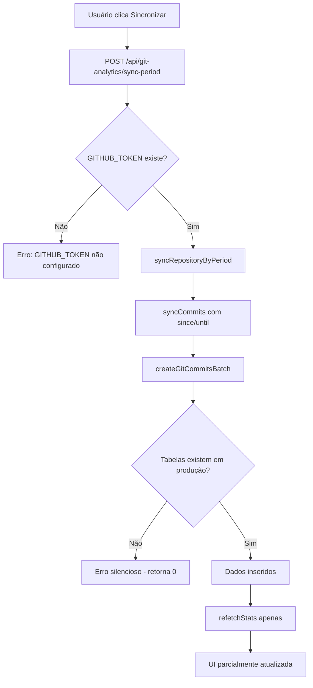
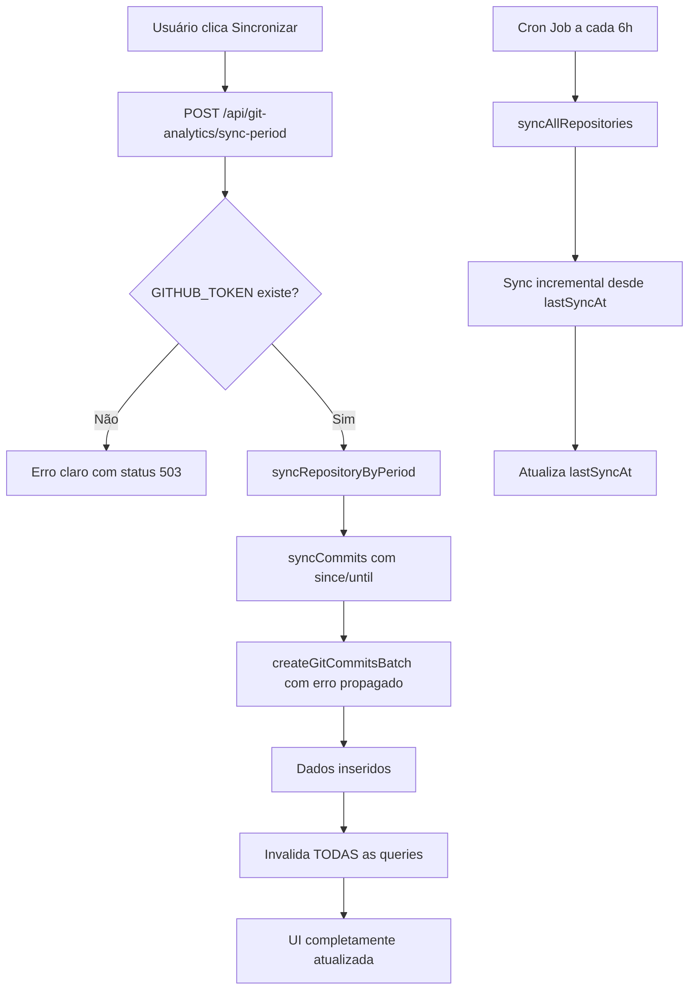

# Plano de Correção: Módulo Git Analytics

**Branch:** `fix/gitanalytics-api`  
**Data:** 2026-02-25  
**Objetivo:** Garantir que o módulo Git Analytics funcione corretamente em ambos os ambientes (desenvolvimento e produção), com sincronização automática e manual operacional.

---

## Diagnóstico dos Problemas

### 1. `GITHUB_TOKEN` ausente em produção
O arquivo `.replit` define variáveis de ambiente em `[userenv.shared]`, mas **`GITHUB_TOKEN` não está listado**. Isso significa que em produção (Replit Autoscale), a variável não existe, e a função `githubFetch()` em [`server/services/github-sync.ts:34`](server/services/github-sync.ts:34) lança `throw new Error("GITHUB_TOKEN não configurado")` silenciosamente.

### 2. Sem cron job automático para Git Analytics
O [`server/index.ts`](server/index.ts) inicializa `startRecurrenceJob()` e `startPromptsSyncJob()`, mas **não há nenhum job agendado para sincronização automática do Git Analytics**. Por isso os dados param de se atualizar automaticamente.

### 3. Tabelas Git Analytics podem não existir em produção
Não há arquivo de migração SQL para as tabelas `git_repositories`, `git_commits`, `git_pull_requests`, `git_security_alerts`, `git_branches`. O projeto usa `drizzle-kit push` para sincronizar o schema, mas não há evidência de que foi executado no ambiente de produção após a adição dessas tabelas.

### 4. First-sync sem limite de data causa timeout
Em [`server/services/github-sync.ts:311`](server/services/github-sync.ts:311), `since = repo.lastSyncAt || undefined`. Se `lastSyncAt` for `null` (primeira sincronização), a função busca **todos os commits do repositório desde o início**, o que pode causar timeout em produção para repositórios com histórico longo.

### 5. Botão "Sincronizar" não invalida todas as queries
Em [`client/src/pages/git-analytics/index.tsx:168`](client/src/pages/git-analytics/index.tsx:168), após a sincronização, apenas `refetchStats()` é chamado. As queries de commits, PRs, branches e developer-stats **não são invalidadas**, então a UI não reflete os novos dados.

### 6. Tratamento de erros silencioso
[`createGitCommitsBatch`](server/storage.ts:2304) retorna `0` em caso de erro sem propagar a exceção, dificultando o diagnóstico de falhas em produção.

---

## Fluxo Atual vs. Fluxo Corrigido





---

## Plano de Ajustes

### Ajuste 1: Migration SQL para tabelas Git Analytics
**Arquivo:** `migrations/0005_add_git_analytics_tables.sql`

Criar arquivo de migração com `CREATE TABLE IF NOT EXISTS` para todas as tabelas do módulo Git Analytics. Isso garante que em produção as tabelas existam antes de qualquer operação.

```sql
-- Tabelas: git_repositories, git_commits, git_pull_requests, git_security_alerts, git_branches
CREATE TABLE IF NOT EXISTS git_repositories (...);
CREATE TABLE IF NOT EXISTS git_commits (...);
-- etc.
```

---

### Ajuste 2: GITHUB_TOKEN em produção
**Arquivo:** `.replit`

Adicionar `GITHUB_TOKEN` na seção `[userenv.shared]` para que esteja disponível tanto em desenvolvimento quanto em produção no Replit.

```toml
[userenv.shared]
SMTP_USER = "..."
GITHUB_TOKEN = "ghp_..."  # ← adicionar aqui
```

---

### Ajuste 3: Cron Job automático de Git Analytics
**Arquivo novo:** `server/jobs/git-sync.job.ts`

Criar job que executa `syncAllRepositories()` a cada 6 horas:

```typescript
import cron from "node-cron";
import { syncAllRepositories } from "../services/github-sync";

export function startGitSyncJob(): void {
  // Executa a cada 6 horas: 0 */6 * * *
  cron.schedule("0 */6 * * *", async () => {
    console.log("[GitSyncJob] Iniciando sincronização automática...");
    await syncAllRepositories();
  }, { timezone: "America/Sao_Paulo" });
  
  console.log("[GitSyncJob] Job agendado para executar a cada 6 horas");
}
```

---

### Ajuste 4: Registrar o cron job no server/index.ts
**Arquivo:** `server/index.ts`

Adicionar importação e chamada de `startGitSyncJob()` junto com os outros jobs:

```typescript
import { startGitSyncJob } from "./jobs/git-sync.job";
// ...
startGitSyncJob();
```

---

### Ajuste 5: Limitar first-sync a 90 dias
**Arquivo:** `server/services/github-sync.ts`

Na função `syncRepository()`, quando `lastSyncAt` for `null`, usar uma data de 90 dias atrás como `since` para evitar buscar todo o histórico:

```typescript
// Antes:
const since = repo.lastSyncAt || undefined;

// Depois:
const since = repo.lastSyncAt 
  ? new Date(repo.lastSyncAt) 
  : new Date(Date.now() - 90 * 24 * 60 * 60 * 1000); // 90 dias atrás
```

---

### Ajuste 6: Melhorar tratamento de erros no createGitCommitsBatch
**Arquivo:** `server/storage.ts`

Propagar o erro em vez de retornar `0` silenciosamente, e adicionar log detalhado:

```typescript
async createGitCommitsBatch(data: InsertGitCommit[]): Promise<number> {
  if (!db || data.length === 0) return 0;
  try {
    const result = await db.insert(gitCommits).values(data).onConflictDoNothing().returning();
    return result.length;
  } catch (error) {
    console.error("[storage] createGitCommitsBatch error:", error);
    throw error; // propagar para o caller diagnosticar
  }
}
```

---

### Ajuste 7: Atualizar .env.example
**Arquivo:** `.env.example`

Documentar `GITHUB_TOKEN` como variável obrigatória para o módulo Git Analytics:

```env
# GitHub Token - OBRIGATÓRIO para módulo Git Analytics
# Crie em: https://github.com/settings/tokens
# Permissões necessárias: repo (read), security_events (read)
GITHUB_TOKEN=ghp_your_github_token_here
```

---

### Ajuste 8: Endpoint de diagnóstico sync-status
**Arquivo:** `server/routes/git-analytics.ts`

Adicionar endpoint `GET /api/git-analytics/sync-status` que retorna:
- Se `GITHUB_TOKEN` está configurado
- Lista de repositórios com `lastSyncAt` e `syncEnabled`
- Status das tabelas (contagem de registros)

```typescript
router.get("/api/git-analytics/sync-status", requireAuth, async (req, res) => {
  const hasToken = !!process.env.GITHUB_TOKEN;
  const repos = await storage.getGitRepositories();
  // ...
  res.json({ hasToken, repos, counts: { commits, prs, branches } });
});
```

---

### Ajuste 9: Invalidar todas as queries no frontend após sync
**Arquivo:** `client/src/pages/git-analytics/index.tsx`

Usar `queryClient.invalidateQueries` para invalidar todas as queries do módulo após sincronização:

```typescript
import { useQueryClient } from "@tanstack/react-query";
// ...
const queryClient = useQueryClient();

const handleSync = async () => {
  // ... sync ...
  // Invalida TODAS as queries do módulo
  await queryClient.invalidateQueries({ queryKey: ["/api/git-analytics"] });
};
```

---

## Resumo dos Arquivos Afetados

| Arquivo | Tipo de Mudança |
|---------|----------------|
| `migrations/0005_add_git_analytics_tables.sql` | **Novo** - Migration SQL |
| `.replit` | **Editar** - Adicionar GITHUB_TOKEN em userenv.shared |
| `server/jobs/git-sync.job.ts` | **Novo** - Cron job automático |
| `server/index.ts` | **Editar** - Registrar git-sync job |
| `server/services/github-sync.ts` | **Editar** - Limitar first-sync a 90 dias |
| `server/storage.ts` | **Editar** - Propagar erro no createGitCommitsBatch |
| `.env.example` | **Editar** - Documentar GITHUB_TOKEN |
| `server/routes/git-analytics.ts` | **Editar** - Adicionar endpoint sync-status |
| `client/src/pages/git-analytics/index.tsx` | **Editar** - Invalidar todas as queries após sync |

---

## Ordem de Execução Recomendada

1. Criar migration SQL (garante que as tabelas existam em produção)
2. Adicionar GITHUB_TOKEN no `.replit` (desbloqueia a API do GitHub em produção)
3. Criar e registrar o cron job (sincronização automática)
4. Corrigir first-sync e tratamento de erros (robustez)
5. Adicionar endpoint de diagnóstico (observabilidade)
6. Corrigir frontend (UX após sync)
7. Atualizar `.env.example` (documentação)
